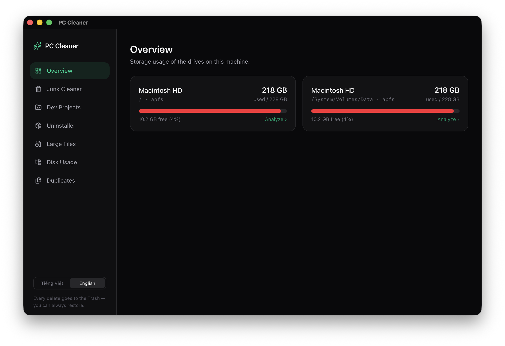

# PC Cleaner

Phần mềm dọn dẹp máy tính cross-platform (macOS / Windows / Linux) xây dựng bằng **Tauri 2 + Rust + Vue 3 + TypeScript + Tailwind CSS 4**. Nhẹ, nhanh, và an toàn — mọi thao tác xóa đều vào Thùng rác.

<p align="center">
  
</p>

📦 **[Tải về bản mới nhất](https://github.com/minhquangqb/pc-cleaner/releases)** — `.dmg` (macOS), `.exe`/`.msi` (Windows), `.deb`/`.AppImage`/`.rpm` (Linux).

## Tính năng

- **Tổng quan** — dung lượng các ổ đĩa (đã dùng / còn trống).
- **Dọn rác** — quét cache ứng dụng, cache trình duyệt, cache công cụ dev (npm, pnpm, Cargo, Homebrew, Xcode DerivedData...), log và file tạm.
- **Dev Projects** — tìm artifact dev tái tạo được theo từng project: `node_modules`, `target`, `venv`...
- **Gỡ ứng dụng** (macOS) — liệt kê app đã cài, gỡ kèm file leftover trong `~/Library`.
- **File lớn** — tìm các file lớn nhất trong thư mục bất kỳ (ngưỡng MB tùy chỉnh).
- **Phân tích dung lượng** — duyệt cây thư mục theo cột kiểu OmniDiskSweeper, size tính nền.
- **Trùng lặp** — tìm file trùng nội dung theo 3 tầng: size → hash 64KB đầu → full BLAKE3 hash.
- **Tray** — kiểm tra rác định kỳ, thông báo khi rác vượt 5GB.
- Giao diện **Tiếng Việt / English**.

## An toàn

- Mọi thao tác xóa đều **chuyển vào Thùng rác** (crate `trash`), không bao giờ xóa vĩnh viễn.
- Backend validate từng đường dẫn trước khi xóa (`src-tauri/src/safety.rs`):
  - Chỉ cho phép xóa trong home directory hoặc temp dir.
  - Danh sách protected paths (home, Documents, Desktop, `.ssh`, `/System`, `C:\Windows`...) không bao giờ được đụng tới.
  - Canonicalize đường dẫn để chặn `..` và symlink trick.
- Luôn quét → hiển thị → người dùng chọn → xác nhận → mới xóa.

## Phát triển

```bash
pnpm install
pnpm tauri dev      # chạy app dev
pnpm tauri build    # đóng gói bản release
```

Test backend:

```bash
cd src-tauri && cargo test --lib
```

## Cấu trúc

```
src/                  # Vue 3 frontend
  views/              # Dashboard, Junk, LargeFiles, Dupes
  components/         # ConfirmClean modal
  api.ts              # invoke wrappers + formatBytes
src-tauri/src/
  lib.rs              # Tauri commands
  safety.rs           # protected paths + trash
  junk.rs             # junk category scanner
  large.rs            # large file scanner
  dupes.rs            # duplicate finder (BLAKE3)
  disk.rs             # disk usage (sysinfo)
```
